---
## Front matter
title: "Отчёт по лабараторной работе No5"
subtitle: "Основы работы с Midnight Commander"
author: "Бурыкина Софья Дмитриевна"

## Generic otions
lang: ru-RU
toc-title: "Содержание"

## Bibliography
bibliography: bib/cite.bib
csl: pandoc/csl/gost-r-7-0-5-2008-numeric.csl

## Pdf output format
toc: true # Table of contents
toc-depth: 2
lof: true # List of figures
lot: true # List of tables
fontsize: 12pt
linestretch: 1.5
papersize: a4
documentclass: scrreprt
## I18n polyglossia
polyglossia-lang:
  name: russian
  options:
	- spelling=modern
	- babelshorthands=true
polyglossia-otherlangs:
  name: english
## I18n babel
babel-lang: russian
babel-otherlangs: english
## Fonts
mainfont: PT Serif
romanfont: PT Serif
sansfont: PT Sans
monofont: PT Mono
mainfontoptions: Ligatures=TeX
romanfontoptions: Ligatures=TeX
sansfontoptions: Ligatures=TeX,Scale=MatchLowercase
monofontoptions: Scale=MatchLowercase,Scale=0.9
## Biblatex
biblatex: true
biblio-style: "gost-numeric"
biblatexoptions:
  - parentracker=true
  - backend=biber
  - hyperref=auto
  - language=auto
  - autolang=other*
  - citestyle=gost-numeric
## Pandoc-crossref LaTeX customization
figureTitle: "Рис."
tableTitle: "Таблица"
listingTitle: "Листинг"
lofTitle: "Список иллюстраций"
lotTitle: "Список таблиц"
lolTitle: "Листинги"
## Misc options
indent: true
header-includes:
  - \usepackage{indentfirst}
  - \usepackage{float} # keep figures where there are in the text
  - \floatplacement{figure}{H} # keep figures where there are in the text
---

# Цель работы

Цель данной лабараторной работы - приобретение практических навыков работы в Midnight Commander и освоение инструкций языка ассемблера mov и int

# Теоретическое введение

Более подробно об Unix см. в [@gnu-doc:bash;@newham:2005:bash;@zarrelli:2017:bash;@robbins:2013:bash;@tannenbaum:arch-pc:ru;@tannenbaum:modern-os:ru].

# Выполнение лабораторной работы

Открыла Midnight Commander  (рис. @fig:001).

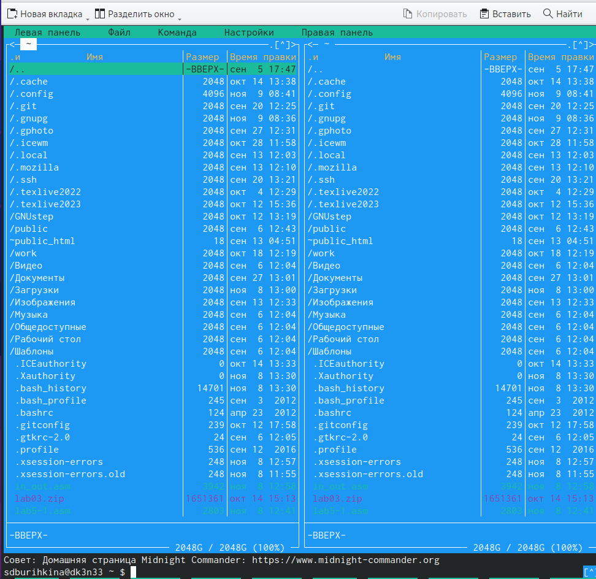{#fig:001 width=70%}

Перешла в каталог study (рис. @fig:002).

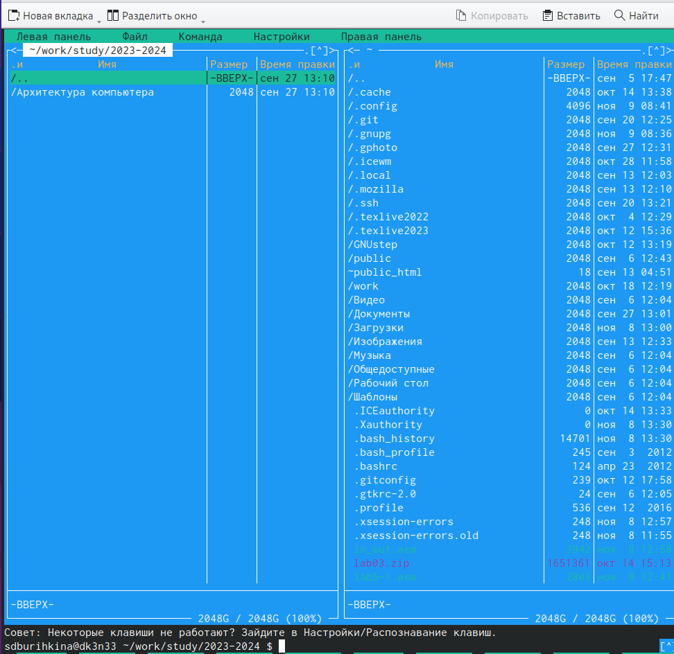{#fig:002 width=70%}

Создала  каталог lab05 (рис. @fig:003).

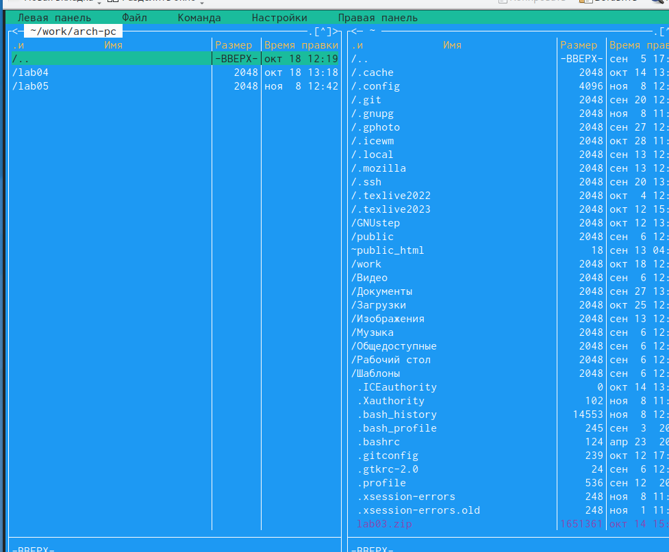{#fig:003 width=70%}

Пользуясь строкой ввода и командой touch создала файл lab5-1.asm (рис. @fig:004).

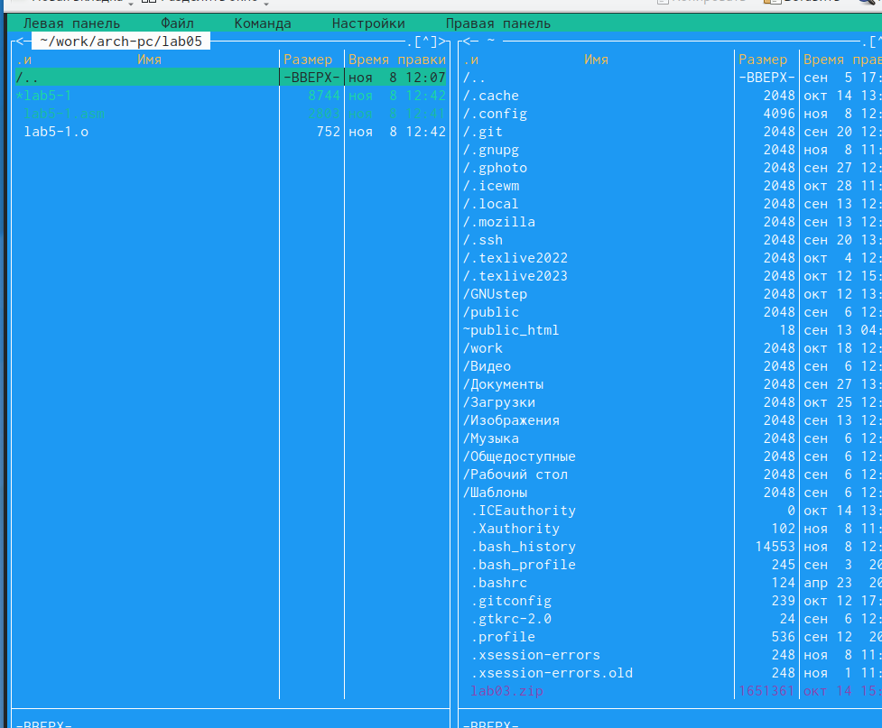{#fig:004 width=70%}

Открыла редактор nano (рис. @fig:005).

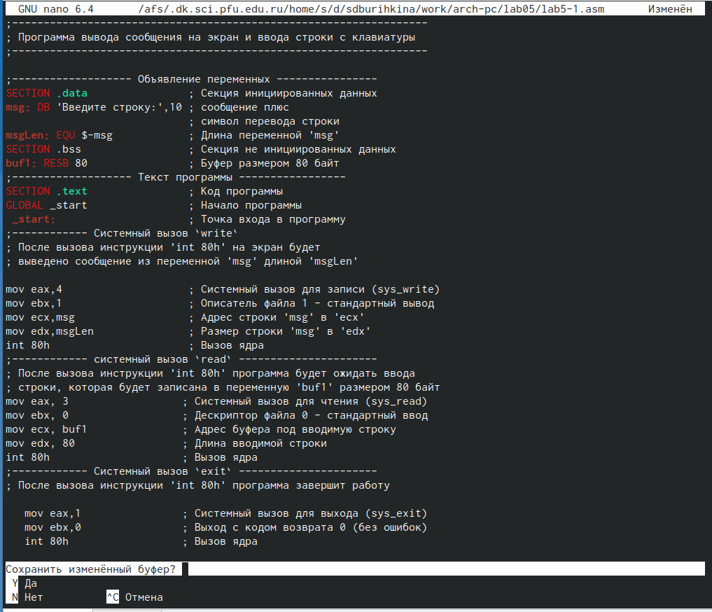{#fig:005 width=70%}

Открыла файл lab5-1.asm написала программу (рис. @fig:006).

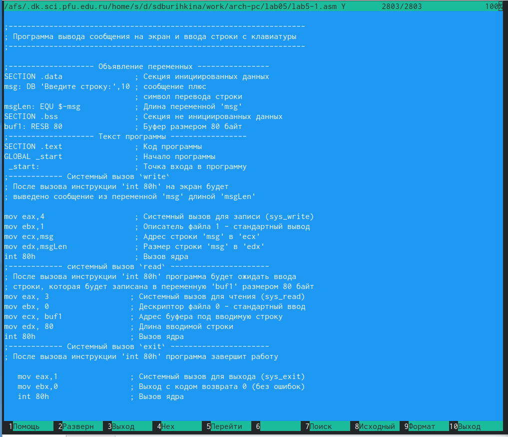{#fig:006 width=70%}

Создаю объектный файл lab5-1.o, выполняю клмпоновку объектного файла и запускаю исполяемыйй файл  (рис. @fig:007).

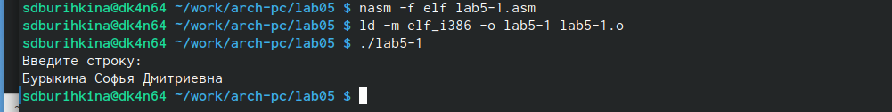{#fig:007 width=70%}

Скачала файл in_out.asm создала копию lab5-1.asm с именем lab5-2.asm. В файле lab5-2.asm заменила подпрограмму sprintLF на sprint. Создала исполняемый файл и проверила его работу (рис. @fig:008).
 Ответ на вопрос: Отличается строкой вывода строки.
 
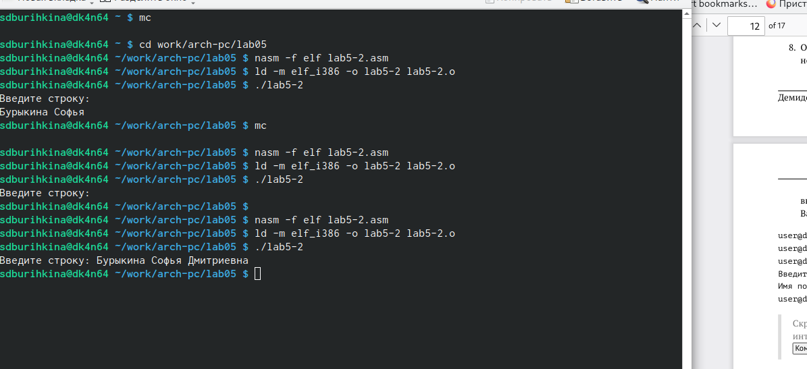{#fig:008 width=70%} 

# Самостоятельная работа

Копирую файл lab5-1.ams с именем lad5-3.asm   (рис. @fig:009).

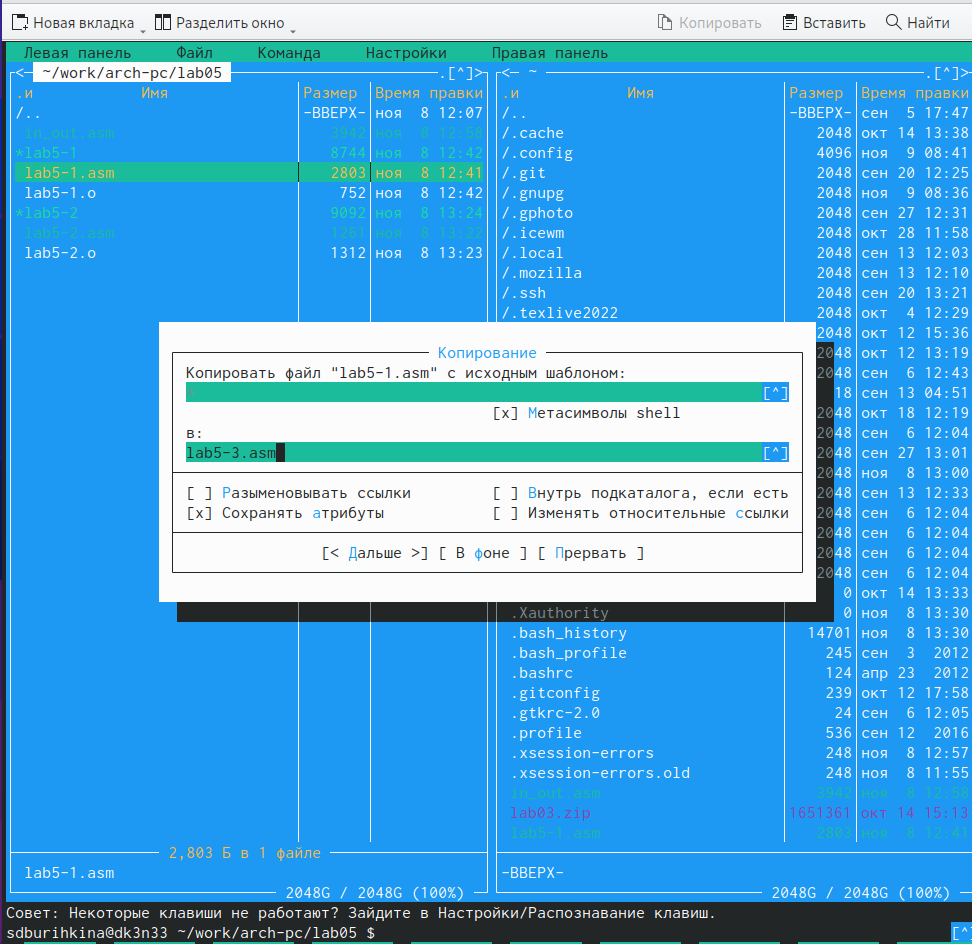{#fig:009 width=70%} 

Изменила код программы и запустила исполняемый файл ( рис. @fig:010).

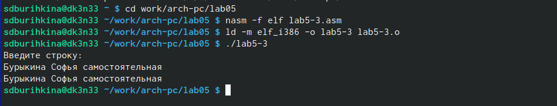{#fig:010 width=70%} 

Программа 1  ( рис. @fig:011).

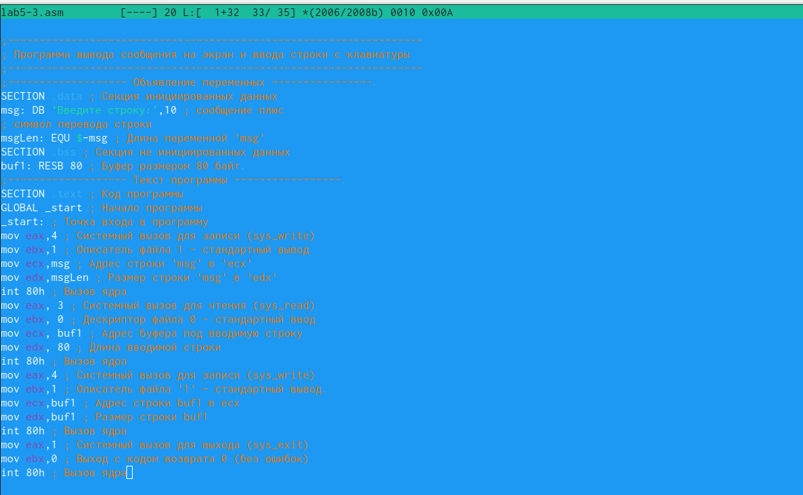{#fig:011 width=70%} 

Скопировала файл lab5-2.asm с именем lab5-4.asm и скомпоновала его в исполняемый файл,запускаю исполняемый файл  (рис. @fig:012).

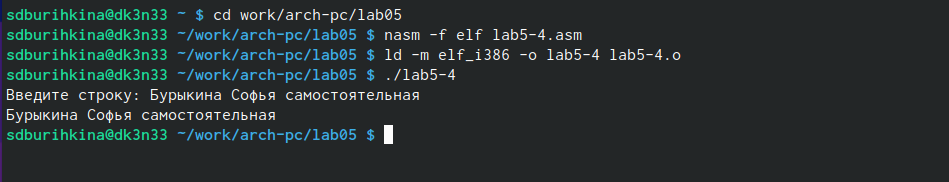{#fig:012 width=70%}

Программа 2 ( рис. @fig:013).

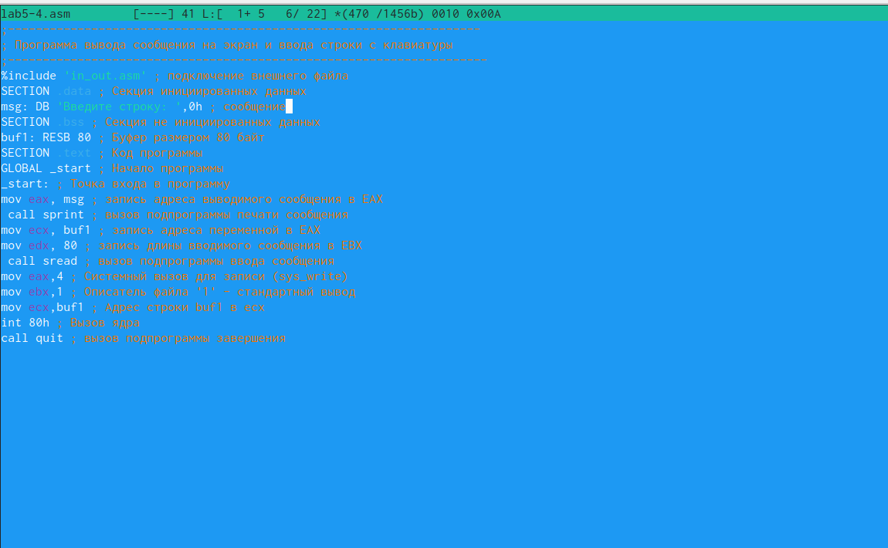{#fig:013 width=70%} 

# Выводы

Я приобрела практические навыки работы в Midnight Commander и освоила инструкции языка ассемблера mov и int.

# Список литературы{.unnumbered}

::: {#refs}
:::
