---
## Front matter
title: "Лабораторная работа No6."
subtitle: "Арифметические операции в NASM."
author: "Бурыкина Софья Дмитриевна"

## Generic otions
lang: ru-RU
toc-title: "Содержание"

## Bibliography
bibliography: bib/cite.bib
csl: pandoc/csl/gost-r-7-0-5-2008-numeric.csl

## Pdf output format
toc: true # Table of contents
toc-depth: 2
lof: true # List of figures
lot: true # List of tables
fontsize: 12pt
linestretch: 1.5
papersize: a4
documentclass: scrreprt
## I18n polyglossia
polyglossia-lang:
  name: russian
  options:
	- spelling=modern
	- babelshorthands=true
polyglossia-otherlangs:
  name: english
## I18n babel
babel-lang: russian
babel-otherlangs: english
## Fonts
mainfont: PT Serif
romanfont: PT Serif
sansfont: PT Sans
monofont: PT Mono
mainfontoptions: Ligatures=TeX
romanfontoptions: Ligatures=TeX
sansfontoptions: Ligatures=TeX,Scale=MatchLowercase
monofontoptions: Scale=MatchLowercase,Scale=0.9
## Biblatex
biblatex: true
biblio-style: "gost-numeric"
biblatexoptions:
  - parentracker=true
  - backend=biber
  - hyperref=auto
  - language=auto
  - autolang=other*
  - citestyle=gost-numeric
## Pandoc-crossref LaTeX customization
figureTitle: "Рис."
tableTitle: "Таблица"
listingTitle: "Листинг"
lofTitle: "Список иллюстраций"
lotTitle: "Список таблиц"
lolTitle: "Листинги"
## Misc options
indent: true
header-includes:
  - \usepackage{indentfirst}
  - \usepackage{float} # keep figures where there are in the text
  - \floatplacement{figure}{H} # keep figures where there are in the text
---

# Цель работы
 Цель даной лабораторной работы - приобретения практических навыков арифметических инструкций языка ассемблера NASM.

# Теоретическое введение

Большинство инструкций на языке ассемблера требуют обработки операндов. Адрес опе-
ранда предоставляет место, где хранятся данные, подлежащие обработке. Это могут быть
данные хранящиеся в регистре или в ячейке памяти. Далее рассмотрены все существующие
способы задания адреса хранения операндов – способы адресации.
Существует три основных способа адресации:
• Регистровая адресация – операнды хранятся в регистрах и в команде используются
имена этих регистров, например: mov ax,bx.
• Непосредственная адресация – значение операнда задается непосредственно в ко-
манде, Например: mov ax,2.
• Адресация памяти – операнд задает адрес в памяти. В команде указывается символи-
ческое обозначение ячейки памяти, над содержимым которой требуется выполнить
операцию.
Например, определим переменную intg DD 3 – это означает, что задается область памяти
размером 4 байта, адрес которой обозначен меткой intg. В таком случае, команда
mov eax,intg
копирует из памяти по адресу intg данные в регистр eax. В свою очередь команда
mov intg,eax
запишет в память по адресу intg данные из регистра eax.
Также рассмотрим команду
mov eax,intg

Более подробно об Unix см. в [@gnu-doc:bash;@newham:2005:bash;@zarrelli:2017:bash;@robbins:2013:bash;@tannenbaum:arch-pc:ru;@tannenbaum:modern-os:ru].

# Выполнение лабораторной работы

Создала каталог для программам лабораторной работы No 6, перешла в него и
создала файл lab6-1.asm (рис. @fig:001).

{#fig:001 width=70%}

Создала исполняемый файл (рис. @fig:002).

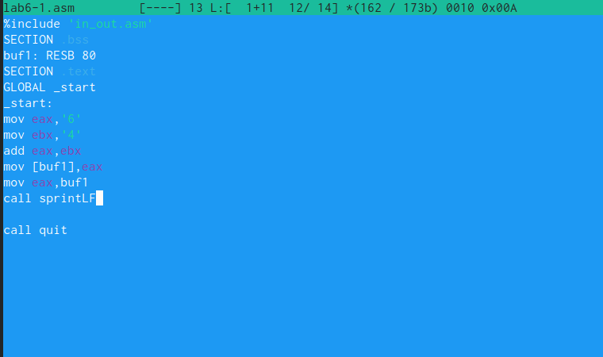{#fig:002 width=70%}

Создала исполняемый файл запустила его (рис. @fig:003).

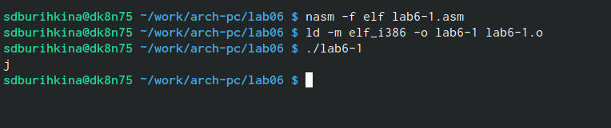{#fig:003 width=70%}

Изменила текст программы (рис. @fig:004).

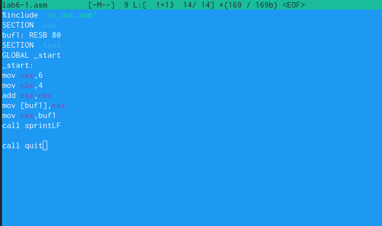{#fig:004 width=70%}

Создала исполняемый файл после изменения и запустила его (рис. @fig:005).

Ответ на вопрс: нет не отображается ничего

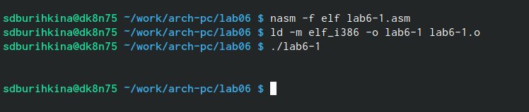{#fig:005 width=70%}

Создала файл lab6-2.asm в каталоге (рис. @fig:006).

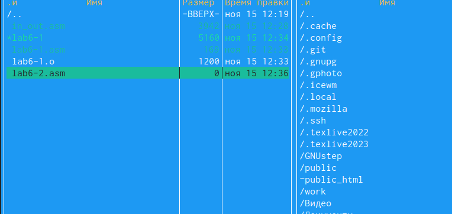{#fig:006 width=70%}

Создала испольняемый файл (рис. @fig:007).

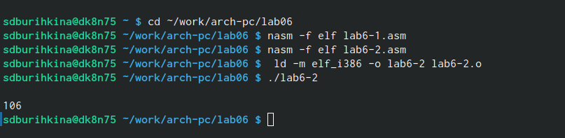{#fig:007 width=70%}

Изменила содержимое файла (рис. @fig:008).

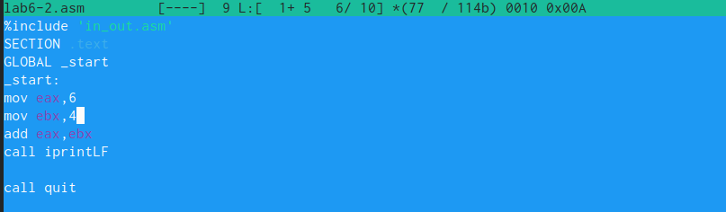{#fig:008 width=70%}

Полученный пезультат 10 при исполнение программы (рис. @fig:009).

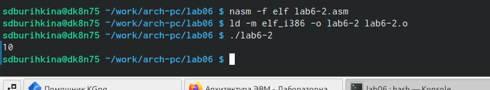{#fig:009 width=70%}

Заменила функцию iprintLF на iprint. Получила результат. Отличаеться выводом спроки (рис. @fig:010).

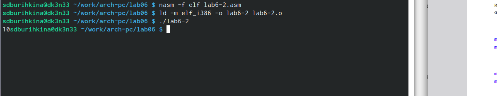{#fig:010 width=70%}

Создала файл lab6-3.asm в каталоге (рис. @fig:011).

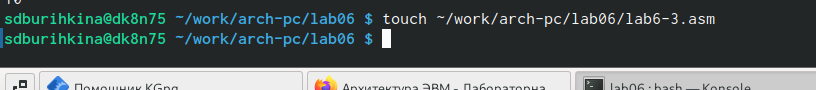{#fig:011 width=70%}

Ввелла тект программы (рис. @fig:012).

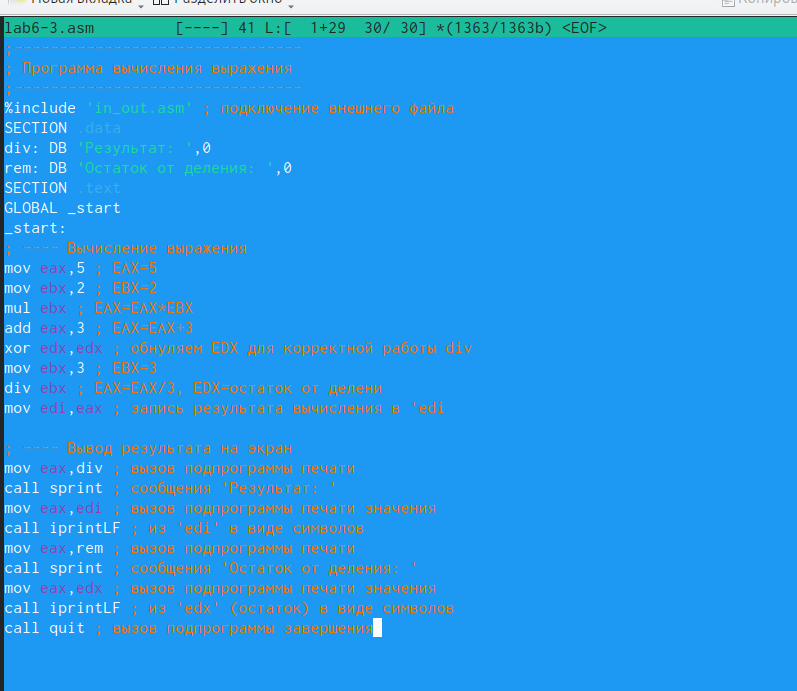{#fig:012 width=70%}

Создала исполняемый файл и запустила его (рис. @fig:013).

{#fig:013 width=70%}

Изменила текст программы для вычисления выражения  (рис. @fig:014).

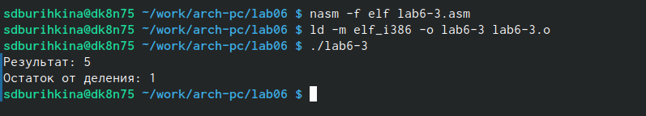{#fig:014 width=70%}

Создала файл variant.asm в каталоге (рис. @fig:015).

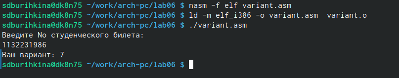{#fig:015 width=70%} 

# Ответы на вопросы 

 1 
 Ответ: sprint  выводит сообщения на экран, перед вызовом sprint в регистр eax необходимо
записать выводимое сообщение (mov eax,msg).Также sprintLF работает аналогично sprint, но при выводе на экран добавляет к сообщению символ перевода строки.
 2 
 Ответ: mov ecx, x запись адреса переменной 'EAX'
    mov edx, 80 запись длины вводимого сообщения в `EBX'
    call sread вызов подпрограммы ввода сообщения
 3
 Ответ: call - вызов, atoi – функция преобразует ascii-код символа в целое число и записыает результат в регистр eax, перед вызовом atoi в регистр eax необходимо записать число (mov
eax,int).
 4 
 Ответ: call sread вывод программы ввода сообщения.
 5 
 Ответ: процессор  поделит число, старшие биты которого хранит регистр edx, а младшие eax на значение, хранящееся в регистре ebx.
 6 
 Ответ: для вызова прерывания с указанным номером такой как edx.
 7 
 Ответ: call iprintLF; call quit
 
# Cамостоятельная работа 
  
Создала исполняемый файл и проверила его работу  Ответ x1 (рис. @fig:016).

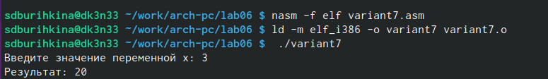{#fig:016 width=70%} 

Ответ x2 (рис. @fig:017).

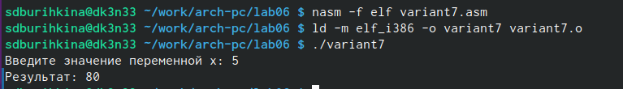{#fig:017 width=70%}
 

# Выводы

Приобрела практические знания арифметических инструкций языка ассемблера NASM.

# Список литературы{.unnumbered}

::: {#refs}
:::
