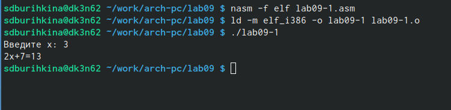
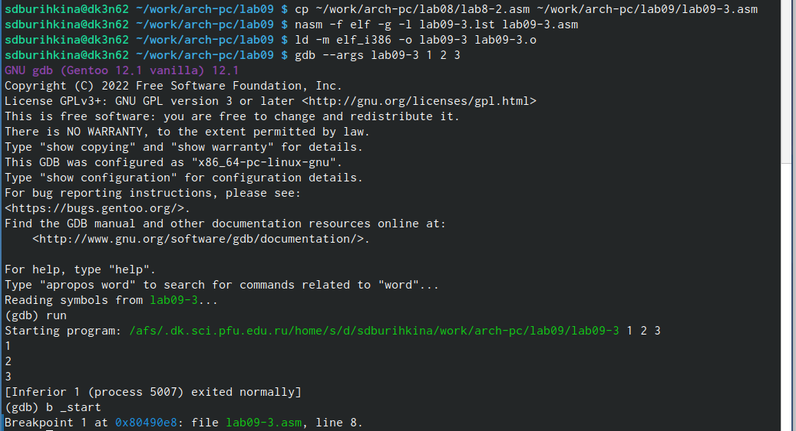

---
## Front matter
title: "Лабораторная работа No9"
subtitle: "Понятие подпрограммы.Отладчик GDB."
author: "Бурыкина Софья Дмитриенва"

## Generic otions
lang: ru-RU
toc-title: "Содержание"

## Bibliography
bibliography: bib/cite.bib
csl: pandoc/csl/gost-r-7-0-5-2008-numeric.csl

## Pdf output format
toc: true # Table of contents
toc-depth: 2
lof: true # List of figures
lot: true # List of tables
fontsize: 12pt
linestretch: 1.5
papersize: a4
documentclass: scrreprt
## I18n polyglossia
polyglossia-lang:
  name: russian
  options:
	- spelling=modern
	- babelshorthands=true
polyglossia-otherlangs:
  name: english
## I18n babel
babel-lang: russian
babel-otherlangs: english
## Fonts
mainfont: PT Serif
romanfont: PT Serif
sansfont: PT Sans
monofont: PT Mono
mainfontoptions: Ligatures=TeX
romanfontoptions: Ligatures=TeX
sansfontoptions: Ligatures=TeX,Scale=MatchLowercase
monofontoptions: Scale=MatchLowercase,Scale=0.9
## Biblatex
biblatex: true
biblio-style: "gost-numeric"
biblatexoptions:
  - parentracker=true
  - backend=biber
  - hyperref=auto
  - language=auto
  - autolang=other*
  - citestyle=gost-numeric
## Pandoc-crossref LaTeX customization
figureTitle: "Рис."
tableTitle: "Таблица"
listingTitle: "Листинг"
lofTitle: "Список иллюстраций"
lotTitle: "Список таблиц"
lolTitle: "Листинги"
## Misc options
indent: true
header-includes:
  - \usepackage{indentfirst}
  - \usepackage{float} # keep figures where there are in the text
  - \floatplacement{figure}{H} # keep figures where there are in the text
---

# Цель работы
Приобретение навыков написания программ с использованием подпрограмм. 

# Теоретическое введение

Отладчики позволяют управлять ходом выполнения программы, контролировать и из-
менять данные. Это помогает быстрее найти место ошибки в программе и ускорить её
исправление. Наиболее популярные способы работы с отладчиком — это использование
точек останова и выполнение программы по шагам.
Пошаговое выполнение — это выполнение программы с остановкой после каждой строчки,
чтобы программист мог проверить значения переменных и выполнить другие действия.

Более подробно об Unix см. в [@gnu-doc:bash;@newham:2005:bash;@zarrelli:2017:bash;@robbins:2013:bash;@tannenbaum:arch-pc:ru;@tannenbaum:modern-os:ru].

# Выполнение лабораторной работы

 Ввелла программу с листинга 9.1(рис. @fig:001).

{#fig:001 width=70%}

Изменила текст программы добавив подпрограмму _subcalcul (рис. @fig:002).(рис. @fig:003).

{#fig:002 width=70%}

{#fig:003 width=70%}

Создала файл lab09-2.asm с текстом программы из Листинга 9.2.(рис. @fig:004).(рис. @fig:005).
{#fig:004 width=70%}

{#fig:005 width=70%}

Установила брейкпоинт на метку _start, с которой начинается выполнение любой ассемблерной программы, и запустила её.(рис. @fig:006 ). (рис. @fig:007 ). (рис. @fig:008 ). (рис. @fig:009). 

{#fig:006 width=70%}

{#fig:007width=70%}

{#fig:008 width=70%}

{#fig:009 width=70%}

Посмотрела информацию о всех установленных точках (рис. @fig:010). 
 
{#fig:010 width=70%}

Посмотрим значение переменной msg1 по имени (рис. @fig:011).  (рис. @fig:012). 

{#fig:011 width=70%}

{#fig:012 width=70%}

С помощью команды set изменила значение регистра ebx.  (рис. @fig:013). 

{#fig:013 width=70%}

Я копирую файл lab8-2.asm в папку с лабараторной номер 9 и называю его lab09-3.asm,создаю исполняемый файл и запускаю его через gdb. Эта прогрмма должна находить произведение аргументов. Тауже ставлю точку останова на месту старт  (рис. @fig:014). 

{#fig:014 width=70%}

Рассматриваю позиции стека, так как у меня всего три аргумента на шаге (+20) выдаёт ошибку  (рис. @fig:015). 

{#fig:015 width=70%}

# Самостоятельная работа 

Создаю файл lab09-3.asm для выполнение первого задания из самостоятельной работы. Ввожу текст листинга 9.1 для удобства. Пишу прграмму согласно 7 варианту лабаратоорной работы номер 8 (рис. @fig:016). 

{#fig:016 width=70%}

Создаю файл lab09-4.asm для выполнения второго пункто лабараторной работы, ввожу туда текст листинга 9.3, сохраняю, создаю исполняемый файл и запускаю его. Убеждаюсь, что результат неверный. Ответ должен быть 25 (рис. @fig:017). 

{#fig:017 width=70%}

Запускаю откладчик, смотрю как изменяется регистры eax,ebx,ecx пошагово с помощью команды si. Замечаю что на третьем шаге регистр ebx имеет значение 5, а на четвёртом шаге ecx и eax перемножаются, что даёт неверный результат. Следовательно изменяю программу так, чтобы резултат сложения записывался и eax(рис. @fig:018).

{#fig:018 width=70%}

Снова неверный результат, нахожу ошибку в именованиях регистрах, вижу ошибку в сложение и меняю это (рис. @fig:019).

{#fig:019 width=70%}

Создаю исполняемый файл и запускаю его (рис. @fig:020).

{#fig:020 width=70%}

# Выводы

Приобрела навыки написание программ с использованием подпрограмм. Познакомилась с мотодами откладки при помощи GDB и его основными возможностями.
# Список литературы{.unnumbered}

::: {#refs}
:::
